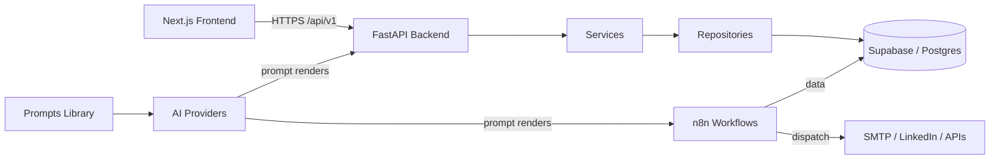

# Architecture

## Overview

AgencyOS is a modular system with a strict layer separation. The FastAPI
backend owns business logic; n8n owns cross-service automation; Supabase owns
data and authorization (RLS); the Next.js frontend is a thin consumer.



## Layering rules (backend)

```
endpoints (HTTP)  →  services (business logic)  →  repositories (data)  →  models (ORM)
```

- Endpoints never run SQL or business rules.
- Services never talk HTTP details (status codes) — they raise/return domain results.
- Repositories are the only layer that touches the persistence layer.
- Prompts are versioned in `prompts/` and consumed by services by `name@version`.

## Data ownership

| Concern       | Owner          |
| ------------- | -------------- |
| Schema / RLS  | `database/`    |
| Migrations    | `database/migrations/` + `backend/alembic/` |
| Automation    | `workflows/n8n/` |
| Prompt content | `prompts/`     |
| Business logic| `backend/app/services/` |

## Automation engine

Beyond n8n's cross-service automation, the backend ships its own workflow
execution engine (`backend/app/workers/` + `backend/app/services/`) that owns
the tenant-facing automation loop:

```
API (queue / retry / events / schedule)
   → WorkflowExecutionService / WorkflowEventService / ScheduleDispatcher
   → repositories → Postgres (workflow_executions / workflow_events)
   → ExecutionWorker (retries → queue drain → stale-timeout sweep → schedule ticks)
   → adapters (n8n / provider) → terminal states + execution_events timeline
```

- State lives in Postgres; workers are restart-safe and horizontally scalable.
  Optimistic transitions mean exactly one worker wins each claim.
- A global **kill switch** (`AutomationControlService`, backed by
  `system_settings`) can pause queueing, retries, schedule dispatch, and event
  publishing operator-wide without dropping data (see
  `docs/api/endpoints/automation-control.md`). The worker gate is fail-closed.
- Worker liveness is surfaced via `worker_health` heartbeats and the
  `monitoring/` endpoints; retention for the append-only `execution_events`
  timeline is a separate worker.
- Credentials used by automations are envelope-encrypted at rest
  (`CredentialCryptoService`) with versioned key rotation.

See `docs/operations/admin-guide.md` and `docs/operations/troubleshooting-automation.md`
for the operational view.

## Environments

- `development` — local: Postgres + n8n via Docker, backend/frontend on host.
- `staging` — full docker compose stack, seed data, real AI providers in test mode.
- `production` — managed Supabase, backend + frontend behind TLS, n8n restricted.

Diagram source files live in `diagrams/` (Mermaid or PlantUML `.puml`).
