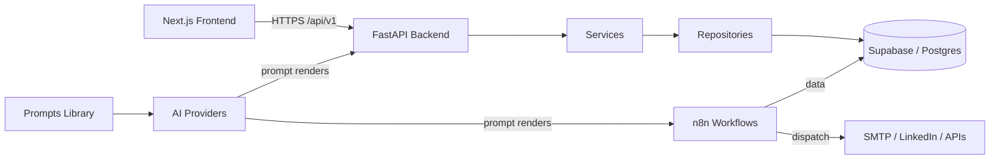

# Architecture

## Overview

AgencyOS is a modular system with a strict layer separation. The FastAPI
backend owns business logic; n8n owns cross-service automation; Supabase owns
data and authorization (RLS); the Next.js frontend is a thin consumer.



## Layering rules (backend)

```
endpoints (HTTP)  →  services (business logic)  →  repositories (data)  →  models (ORM)
```

- Endpoints never run SQL or business rules.
- Services never talk HTTP details (status codes) — they raise/return domain results.
- Repositories are the only layer that touches the persistence layer.
- Prompts are versioned in `prompts/` and consumed by services by `name@version`.

## Data ownership

| Concern       | Owner          |
| ------------- | -------------- |
| Schema / RLS  | `database/`    |
| Migrations    | `database/migrations/` + `backend/alembic/` |
| Automation    | `workflows/n8n/` |
| Prompt content | `prompts/`     |
| Business logic| `backend/app/services/` |

## Environments

- `development` — local: Postgres + n8n via Docker, backend/frontend on host.
- `staging` — full docker compose stack, seed data, real AI providers in test mode.
- `production` — managed Supabase, backend + frontend behind TLS, n8n restricted.

Diagram source files live in `diagrams/` (Mermaid or PlantUML `.puml`).
