# Database ERD (V1 + Phase 5D)

Entity-relationship diagram for the core tables. Rendered with Mermaid.

```mermaid
erDiagram
    organizations ||--o{ users : "has"
    organizations ||--o{ lead_sources : "has"
    organizations ||--o{ leads : "owns"
    organizations ||--o{ lead_research : "owns"
    organizations ||--o{ outreach_messages : "owns"
    organizations ||--o{ outreach_attempts : "owns"
    organizations ||--o{ follow_ups : "owns"
    organizations ||--o{ manual_outreach_queue : "owns"
    organizations ||--o{ conversations : "owns"
    organizations ||--o{ conversation_messages : "owns"
    organizations ||--o{ activity_logs : "owns"
    organizations ||--o{ import_jobs : "owns"
    organizations ||--o{ import_row_errors : "owns"
    organizations ||--o{ provider_usage : "owns"
    organizations ||--o{ ai_memories : "owns"
    organizations ||--o{ knowledge_items : "owns"
    organizations ||--o{ agent_runs : "owns"
    organizations ||--o{ agent_state : "owns"
    organizations ||--o{ notifications : "owns"
    organizations ||--o{ approval_requests : "owns"
    organizations ||--o{ approval_logs : "owns"
    organizations ||--o{ briefings : "owns"
    organizations ||--o{ growth_metrics : "owns"
    organizations ||--o{ growth_forecasts : "owns"
    organizations ||--o{ business_insights : "owns"

    users ||--o{ leads : "owns/assigns"
    users ||--o{ manual_outreach_queue : "assigned"
    users ||--o{ conversation_messages : "sent by"
    users ||--o{ activity_logs : "acted"
    users ||--o{ import_jobs : "created"
    users ||--o{ notifications : "receives"
    users ||--o{ approval_requests : "requests/approves"

    lead_sources ||--o{ leads : "sources"
    lead_sources ||--o{ import_jobs : "imports to"

    leads ||--o| lead_research : "researched by"
    leads ||--o{ outreach_attempts : "receives"
    leads ||--o{ follow_ups : "receives"
    leads ||--o{ manual_outreach_queue : "queued"
    leads ||--o{ conversations : "chats in"
    leads ||--o{ activity_logs : "logged"

    outreach_messages ||--o{ outreach_attempts : "instantiated by"
    outreach_attempts ||--o{ follow_ups : "spawns"

    conversations ||--o{ conversation_messages : "contains"
    import_jobs ||--o{ import_row_errors : "logs"
    ai_memories ||--o{ knowledge_items : "promoted from"
    workflows ||--o{ approval_requests : "gated by"
    workflow_executions ||--o{ approval_requests : "gated by"
    approval_requests ||--o{ approval_logs : "audited by"
```

## Relationships at a glance

| Parent            | Child                 | Cardinality | Notes                                   |
| ----------------- | --------------------- | ----------- | --------------------------------------- |
| `organizations`   | everything else       | 1 → N       | tenant root; `organization_id` everywhere |
| `users`           | `leads.owner_user_id` | 1 → N       | optional owner                          |
| `lead_sources`    | `leads`               | 1 → N       | optional; `ON DELETE SET NULL`          |
| `leads`           | `lead_research`       | 1 → 1       | `UNIQUE (lead_id)`                      |
| `leads`           | `outreach_attempts`   | 1 → N       | `ON DELETE CASCADE`                     |
| `outreach_attempts`| `follow_ups`          | 1 → N       | optional anchor attempt                 |
| `leads`           | `conversations`       | 1 → N       | at most one open per lead/channel       |
| `conversations`   | `conversation_messages` | 1 → N      | append-only; cascade delete             |
| `import_jobs`     | `import_row_errors`   | 1 → N       | append-only; cascade delete             |
| `ai_memories`     | `knowledge_items`     | 1 → N       | promotion provenance; `ON DELETE SET NULL` |
| `workflows`       | `approval_requests`   | 1 → N       | optional gating link; `ON DELETE SET NULL` |
| `workflow_executions` | `approval_requests` | 1 → N     | optional gating link; `ON DELETE SET NULL` |
| `approval_requests` | `approval_logs`     | 1 → N       | immutable audit trail; cascade delete   |

## Key constraints

- **Duplicate protection** (`leads`): partial unique indexes on
  `email_normalized`, `phone_normalized` (phone + WhatsApp share a bucket),
  and `website_domain`, each scoped to `organization_id`.
- **One open thread**: partial unique index
  `uq_conversations_open_per_channel (lead_id, channel) WHERE is_open`.
- **Daily rollup**: `uq_provider_usage_daily
  (organization_id, provider, feature, usage_date)`.
- **Agent state**: `uq_agent_state_org_agent (organization_id, agent_name)`.
- **Growth metrics**: `uq_growth_metrics_org_type_period
  (organization_id, metric_type, period_start, period_end)`.
- **Non-negative + ranged checks** on scores, priorities, sizes, and token
  counts throughout.

## Enum dependencies

`users.role` → `user_role`; `leads.status` → `lead_status`; `channel` columns
→ `outreach_channel`; `status` on outreach tables → `outreach_status`;
`import_jobs.status` → `import_status`; `activity_logs.event_type` →
`activity_event_type`; `conversation_messages.sender_type` →
`conversation_sender`. Phase 5D: `ai_memories.memory_type`/`scope` →
`memory_type`/`memory_scope`; `agent_runs.status`/`trigger` →
`agent_run_status`/`agent_run_trigger`; `agent_state.status`/`health` →
`agent_state_status`/`agent_health`; `notifications.type` →
`notification_type`; `approval_requests.status` → `approval_request_status`;
`approval_logs.action` → `approval_log_action`; `briefings.briefing_type` →
`briefing_type`; `business_insights.insight_type`/`severity`/`status` →
`insight_type`/`insight_severity`/`insight_status`. See
`database/migrations/enums/`.
